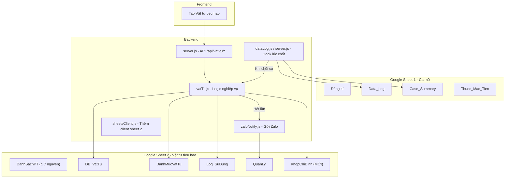
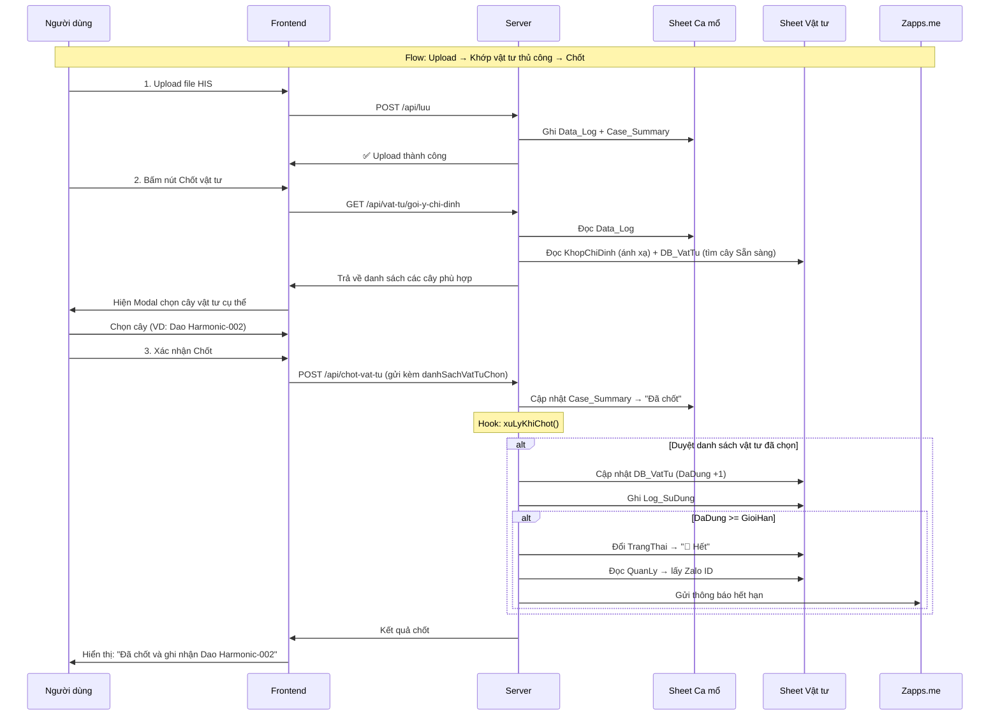

# Tích hợp Module Quản lý Vật tư Tiêu hao vào PM-System (v2)

## Tóm tắt

Tích hợp hệ thống quản lý vật tư tiêu hao vào pm-system. Database vật tư nằm ở **Google Sheet riêng** (khác sheet đăng ký ca mổ). Hệ thống sẽ:
- Khi **chốt** ca mổ → khớp tên chỉ định trong Data_Log với danh mục vật tư → ghi nhận sử dụng
- Quản lý tồn kho: còn bao nhiêu cây, mỗi cây còn bao nhiêu lần
- Tự động khóa dụng cụ hết lần → gửi thông báo Zalo
- Theo dõi trạng thái hư hỏng, nhập mới, báo cáo

---

## Cấu trúc Database hiện có (GIỮ NGUYÊN)

Dựa trên ảnh chụp, 5 tabs trong Google Sheet vật tư đã có sẵn:

### Tab 1: `DanhSachPT` (Danh sách phẫu thuật)
| Cột | Nội dung |
|-----|----------|
| A | Mã bệnh nhân |
| B | Họ Tên BN |
| C | Năm Sinh |
| D | Giới |
| E | Chẩn Đoán |
| F | Phương Pháp PT |
| G | PPPC |
| H | Loại PT |
| I | PTV |
| J | Giờ ĐK |
| K | Vật Tư Tiêu Hao (chứa Mã QL, ví dụ "Dao Harmonic mổ hở-001") |

### Tab 2: `DB_VatTu` (Từng cây cụ thể)
| Cột | Nội dung | Ví dụ |
|-----|----------|-------|
| A | Mã quản lý | Dao Harmonic mổ hở-001 |
| B | Mã BV | DV.VTTH.0017 |
| C | Tên vật tư | Dao Harmonic mổ hở |
| D | Giới hạn | 10 |
| E | Đã dùng | 10 |
| F | Trạng thái | 🔴 Hết / 🟢 Sẵn sàng |
| G | Ngày nhập | 02/02/2026 |
| H | Thông báo | 🟢 Đã báo cáo (05/04) |

### Tab 3: `DanhMucVatTu` (Danh mục loại vật tư)
| Cột | Nội dung | Ví dụ |
|-----|----------|-------|
| A | STT | 1 |
| B | Tên Vật Tư | Dao Harmonic nội soi |
| C | Mã Kế Toán | DV.VTTH.0017 |
| D | Giới Hạn Mặc Định | 10 |
| E | Đơn Vị Tính | cái |
| F | Ghi Chú | |
| G | Ngày Tạo | 16/03/2026 |

### Tab 4: `Log_SuDung` (Lịch sử sử dụng)
| Cột | Nội dung | Ví dụ |
|-----|----------|-------|
| A | Thời gian | 16/03/2026 16:... |
| B | Mã Hồ Sơ | 26336004752 |
| C | Tên Bệnh | TÔ THỊ PHƯƠNG |
| D | Chẩn đoán | theo dõi Gãy xu... |
| E | PPPT | PT KHX đầu dư... |
| F | PTV | BS ĐOÀN ĐÌNH |
| G | Mã Dụng Cụ | Dao Harmonic mổ hở-001 |
| H | Lần dùng | 1, 2, 3... |

### Tab 5: `QuanLy` (Người nhận thông báo Zalo)
| Cột | Nội dung | Ví dụ |
|-----|----------|-------|
| A | Họ tên | Châu Thanh Hu... |
| B | Chức vụ | KTV Gây Mê |
| C | Zalo User ID | 43ee5573083fe161... |
| D | SĐT | |
| E | Quyền | |
| F | Ghi chú | |

---

## User Review Required

> [!IMPORTANT]
> **2 Google Sheet riêng biệt**: Hệ thống pm-system hiện tại đã dùng 1 Sheet cho ca mổ (`GOOGLE_SHEET_ID`). Database vật tư nằm ở sheet KHÁC. Cần thêm biến `GOOGLE_SHEET_ID_VATTU` trong `.env`. Bạn cần cung cấp ID của Google Sheet "Quản Lý Khấu Hao Dụng Cụ" và share quyền Editor cho Service Account.

> [!IMPORTANT]
> **Bảng ánh xạ chỉ định HIS → vật tư**: Tên chỉ định trong file HIS (ví dụ: "chi phí dao đốt điện", "chỉ định sử dụng dao đốt") cần được ánh xạ sang tên vật tư trong DanhMucVatTu (ví dụ: "Dao Harmonic mổ hở"). Tôi sẽ tạo thêm 1 tab `KhopChiDinh` để lưu bảng ánh xạ này. Bạn sẽ cung cấp danh sách ánh xạ sau.

---

## Proposed Changes

### Kiến trúc tổng thể



---

### Tab Google Sheet mới

#### [NEW] Tab `KhopChiDinh` (trong Sheet vật tư)

Bảng ánh xạ tên chỉ định HIS → tên vật tư trong DanhMucVatTu:

| Cột | Nội dung | Ví dụ |
|-----|----------|-------|
| A | Từ khóa chỉ định (trong HIS) | dao đốt điện |
| B | Tên vật tư (trong DanhMucVatTu) | Dao Harmonic mổ hở |
| C | Ghi chú | Chi phí dao đốt, chỉ định dao đốt... |

**Cách hoạt động**: Khi chốt ca, hệ thống duyệt tất cả chỉ định trong Data_Log → so khớp với cột A (chứa keyword) → nếu tên chỉ định chứa keyword → tìm dụng cụ đang "Sẵn sàng" có tên vật tư ở cột B → ghi nhận 1 lần dùng.

---

### Backend

#### [MODIFY] [sheetsClient.js](file:///c:/Users/DELL/Desktop/pm-system/src/sheetsClient.js)

Thêm client cho Google Sheet vật tư (sheet thứ 2):
- Biến `SPREADSHEET_ID_VATTU` đọc từ `process.env.GOOGLE_SHEET_ID_VATTU`
- Thêm các hàm: `docSheetVatTu(tenSheet)`, `themHangVatTu(tenSheet, rows)`, `capNhatVungVatTu(range, values)` — tương tự các hàm cũ nhưng dùng sheet ID thứ 2

#### [NEW] [vatTu.js](file:///c:/Users/DELL/Desktop/pm-system/src/vatTu.js)

Module nghiệp vụ chính (~250-300 dòng):

```
Các hàm chính:
├── layTongQuan()           → Lấy dashboard: tồn kho, cảnh báo, thống kê
├── layTonKho()             → Tồn kho nhóm theo loại vật tư
├── nhapVatTuMoi(data)      → Nhập N cây mới (tự đánh mã: TenVT-001, -002...)
├── ghiNhanSuDung(maQL, infoCa) → +1 lần dùng, cập nhật DB_VatTu + Log_SuDung
├── khopChiDinhVoiVatTu(danhSachMuc) → Đọc KhopChiDinh, so sánh tên mục
│   └── Tìm cây "Sẵn sàng" phù hợp (ưu tiên cây có số dùng thấp nhất)
├── xuLyKhiChot(maBN, ngayMo) → Gọi khi chốt: đọc Data_Log → khớp → ghi nhận
├── baoHongVatTu(data)      → Đổi trạng thái → 🔴 Hỏng
├── xuatBaoCao(filter)      → Xuất báo cáo sử dụng
└── danhDauDaXuLy(maQL)     → Đánh dấu "Đã báo cáo" khi lãnh mới
```

**Logic `xuLyKhiChot()` — hàm quan trọng nhất:**
```
1. Frontend gửi yêu cầu chốt ca kèm danh sách mã quản lý vật tư cụ thể đã chọn (vd: Dao Harmonic mổ hở-002)
2. Đọc Data_Log → lọc các mục thuộc ca này (maBN + ngayMo)
3. Duyệt danh sách mã quản lý do người dùng chọn:
   a. Cập nhật DB_VatTu (DaDung +1) cho từng cây được chọn
   b. Ghi vào Log_SuDung
   c. Nếu DaDung >= GioiHan → đổi trạng thái "🔴 Hết" → gửi Zalo
```

#### [NEW] [zaloNotify.js](file:///c:/Users/DELL/Desktop/pm-system/src/zaloNotify.js)

Gửi thông báo qua Zapps.me API (~80 dòng):
- `guiThongBao(type, toolInfo)` — type: "HẾT HẠN" | "SẮP HẾT" | "HỎNG"
- `layDanhSachNguoiNhan()` — Đọc tab QuanLy, lọc cột C (Zalo User ID)
- Token/URL đọc từ `.env`

Mẫu tin nhắn (giữ nguyên format code cũ):
```
[THÔNG BÁO HẾT HẠN SỬ DỤNG]
--------------------------------
• Vật tư: DAO HARMONIC MỔ HỞ
• Mã QL: Dao Harmonic mổ hở-001
• Tình trạng: Đã dùng 10/10
• Chu kỳ: 02/02 - 05/04/2026
--------------------------------
LƯU Ý: Mã đã bị KHÓA. Vui lòng lập báo cáo và thay mới.
```

#### [MODIFY] [server.js](file:///c:/Users/DELL/Desktop/pm-system/server.js)

Thêm API endpoints:

| Method | Path | Chức năng | Auth |
|--------|------|-----------|------|
| GET | `/api/vat-tu/tong-quan` | Lấy tổng quan: tồn kho, cảnh báo | ✅ Login |
| GET | `/api/vat-tu/ton-kho` | Tồn kho chi tiết theo nhóm | ✅ Login |
| GET | `/api/vat-tu/goi-y-chi-dinh`| Gợi ý các cây vật tư sẵn sàng dựa trên chỉ định HIS | ✅ Login |
| POST | `/api/vat-tu/nhap` | Nhập vật tư mới | ✅ Admin |
| POST | `/api/vat-tu/bao-hong` | Báo hỏng dụng cụ | ✅ Login |
| POST | `/api/vat-tu/bao-cao` | Xuất báo cáo sử dụng | ✅ Login |
| POST | `/api/vat-tu/da-xu-ly` | Đánh dấu đã lãnh mới | ✅ Admin |
| GET | `/api/vat-tu/zalo-managers` | Lấy danh sách người nhận | ✅ Admin |
| POST | `/api/vat-tu/zalo-managers` | Thêm/sửa người nhận Zalo | ✅ Admin |
| GET | `/api/vat-tu/khop-chi-dinh` | Xem bảng ánh xạ HIS → vật tư | ✅ Login |
| POST | `/api/vat-tu/khop-chi-dinh` | Thêm/sửa ánh xạ | ✅ Admin |

**Sửa đổi quan trọng** — Hook vào endpoint `/api/chot-vat-tu` hiện có:
```javascript
// Thay đổi payload: frontend gửi thêm danh sách các cây vật tư đã chọn (danhSachVatTuChon)
// Sau khi chốt thành công (cập nhật Case_Summary xong)
// → Gọi thêm: vatTu.xuLyKhiChot(maBN, ngayMo, danhSachVatTuChon)
```

#### [MODIFY] [.env.example](file:///c:/Users/DELL/Desktop/pm-system/.env.example)

```env
# ID Google Sheet vật tư tiêu hao (Sheet riêng, khác sheet ca mổ)
GOOGLE_SHEET_ID_VATTU=

# --- Cấu hình Zalo Notification (qua Zapps.me) ---
ZALO_ACTIVE=true
ZALO_TOKEN=
ZALO_API_URL=https://bot-api.zapps.me/bot
```

---

### Frontend

#### [MODIFY] [index.html](file:///c:/Users/DELL/Desktop/pm-system/public/index.html)

Thêm tab "📦 Vật tư tiêu hao" vào navigation. Thêm modal chọn cây vật tư khi chốt ca.

#### [MODIFY] [app.js](file:///c:/Users/DELL/Desktop/pm-system/public/app.js)

Thêm section giao diện vật tư tiêu hao:

**1. Dashboard tổng quan:**
- 5 card thống kê: Tổng dụng cụ | Đang hoạt động | Sắp hết | Đã hết | Hư hỏng
- Bảng tồn kho nhóm theo loại (click mở rộng xem từng cây)
- Danh sách cảnh báo: dụng cụ sắp hết/đã hết cần xử lý

**2. Quản lý:**
- Form nhập vật tư mới (Admin): Tên, Mã kế toán, Số lượng, Giới hạn
- Nút báo hỏng: chọn dụng cụ → nhập lý do → khóa
- Nút xuất báo cáo: lọc theo khoảng thời gian + mã vật tư
- Quản lý bảng ánh xạ chỉ định (Admin): thêm/sửa/xóa keyword

**3. Tích hợp vào flow chốt ca:**
- Khi bấm "Chốt vật tư", gọi API lấy các vật tư được gợi ý khớp với chỉ định.
- Hiện popup/modal cho người dùng tự chọn **cây vật tư cụ thể** (VD: chọn Harmonic-002 thay vì 001).
- Chốt ca mổ gửi kèm danh sách ID cây vật tư lên server.

#### [MODIFY] [style.css](file:///c:/Users/DELL/Desktop/pm-system/public/style.css)

Thêm styles cho tab vật tư:
- Card trạng thái: xanh (sẵn sàng), vàng (sắp hết ≤ 2 lần còn), đỏ (hết/hỏng)
- Bảng tồn kho có thể mở rộng/thu gọn
- Modal nhập vật tư, báo hỏng, xuất báo cáo
- Thanh tiến trình cho mỗi cây (ví dụ: 8/10 lần → thanh 80% vàng)
- Modal chọn cây vật tư trong quá trình chốt

---

## Luồng hoạt động chính



---

## Verification Plan

### Automated Tests
```bash
npm start
# Kiểm tra server khởi động không lỗi

# Test API endpoints bằng curl
curl http://localhost:3000/api/vat-tu/tong-quan
curl http://localhost:3000/api/vat-tu/ton-kho
```

### Manual Verification
1. **Nhập vật tư**: Nhập 2 cây "Dao test" giới hạn 3 lần → kiểm tra DB_VatTu có 2 dòng (Dao test-001, -002)
2. **Ánh xạ chỉ định**: Thêm keyword "dao test" → tên vật tư "Dao test" vào tab KhopChiDinh
3. **Chốt ca**: Upload file HIS có chỉ định "dao test" → chốt ca → kiểm tra DB_VatTu.DaDung tăng 1
4. **Hết lần**: Chốt ca đến khi DaDung = GioiHan → kiểm tra trạng thái "🔴 Hết" + Zalo được gửi
5. **Giao diện**: Kiểm tra tab Vật tư hiển thị đúng tồn kho, cảnh báo, thanh tiến trình
6. **Báo hỏng**: Chọn dụng cụ → báo hỏng → kiểm tra trạng thái + Zalo
